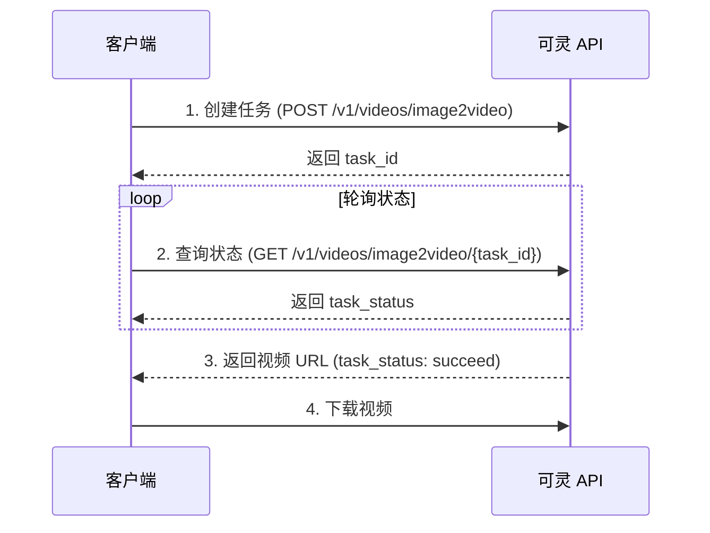

# 可灵 (Kling) 视频 API 使用参考

## 概述

可灵 AI 是快手旗下的 AI 视频生成平台，提供图生视频（Image-to-Video）能力，支持首尾帧控制，非常适合生成 PPT 页面之间的过渡动画。

## API 认证

### JWT Token 生成

可灵 API 使用 JWT (JSON Web Token) 进行认证。

**Token 结构：**

```python
headers = {
    "alg": "HS256",
    "typ": "JWT"
}

payload = {
    "iss": access_key,        # 访问密钥（Access Key）
    "exp": current_time + 1800,  # 过期时间（默认30分钟）
    "nbf": current_time - 5   # 生效时间（当前时间-5秒）
}
```

**请求头：**

```
Authorization: Bearer <jwt_token>
Content-Type: application/json
```

## 环境变量配置

```bash
# 可灵 API 密钥（必需）
Kling_Access_Key=your-access-key
Kling_Secret_Key=your-secret-key
```

## API 端点

### 基础地址

```
https://api-beijing.klingai.com
```

### 创建图生视频任务

**端点：** `POST /v1/videos/image2video`

**请求参数：**

| 参数 | 类型 | 必需 | 说明 |
|------|------|------|------|
| model_name | string | 是 | 模型名称，推荐 `kling-v2-6` |
| image | string | 是 | 起始帧图片（Base64编码，不含前缀） |
| image_tail | string | 否 | 结束帧图片（Base64编码，首尾帧控制时必需） |
| prompt | string | 否 | 正向提示词（转场描述） |
| negative_prompt | string | 否 | 负向提示词 |
| duration | string | 是 | 视频时长，`5` 或 `10` 秒 |
| mode | string | 是 | 生成模式，`std`（标准）或 `pro`（高品质） |
| cfg_scale | float | 否 | 自由度 0-1（仅 V1.x 支持） |
| callback_url | string | 否 | 回调URL |

**请求示例：**

```json
{
  "model_name": "kling-v2-6",
  "image": "<base64_image>",
  "image_tail": "<base64_image>",
  "prompt": "Smooth camera transition with elegant glass morphism effects...",
  "duration": "5",
  "mode": "pro"
}
```

**响应示例：**

```json
{
  "code": 0,
  "message": "success",
  "data": {
    "task_id": "xxxxx-xxxxx-xxxxx",
    "task_status": "submitted"
  }
}
```

### 查询任务状态

**端点：** `GET /v1/videos/image2video/{task_id}`

**任务状态说明：**

| 状态 | 说明 |
|------|------|
| submitted | 已提交，等待处理 |
| processing | 处理中 |
| succeed | 成功完成 |
| failed | 失败 |

**成功响应示例：**

```json
{
  "code": 0,
  "message": "success",
  "data": {
    "task_id": "xxxxx-xxxxx-xxxxx",
    "task_status": "succeed",
    "task_result": {
      "videos": [
        {
          "url": "https://..../video.mp4",
          "duration": 5
        }
      ]
    }
  }
}
```

## 使用建议

### 首尾帧视频生成

1. **必须使用 `pro` 模式** - 首尾帧控制功能仅在 `pro` 模式下可用
2. **推荐 5 秒时长** - 过渡动画一般 5 秒足够，10 秒可能显得过长
3. **图片预处理** - 确保首尾帧图片尺寸一致（推荐 1920x1080）

### 提示词编写

**推荐结构：**
1. 描述摄像机运动（推、拉、摇、移）
2. 描述主体变化（形态、颜色、材质）
3. 描述环境变化（光效、背景）
4. 强调文字保持稳定

**示例：**

```
Smooth camera push forward with gentle parallax motion. 
Glass surfaces catch soft light reflections while gradient 
backgrounds blend seamlessly. All text remains crisp and 
stable throughout the transition. Ambient light particles 
drift slowly across the frame.
```

### 并发限制

- 可灵 API 并发限制为 **3 个任务**
- 建议使用线程池控制并发
- 每个任务大约需要 90-120 秒完成

## 错误处理

### 常见错误码

| 错误码 | 说明 | 解决方案 |
|--------|------|----------|
| 1001 | 认证失败 | 检查 Access Key 和 Secret Key |
| 1002 | 参数错误 | 检查请求参数格式 |
| 1003 | 配额不足 | 检查 API 调用额度 |
| 2001 | 图片格式错误 | 确保图片为 JPG/PNG 格式 |
| 2002 | 图片尺寸过大 | 压缩图片至 4MB 以内 |

### 超时处理

```python
# 推荐超时设置
timeout = 300  # 5分钟
poll_interval = 5  # 5秒轮询一次
```

## 模型版本

| 模型名称 | 说明 | 推荐场景 |
|----------|------|----------|
| kling-v2-6 | 最新版本，支持首尾帧 | PPT 过渡视频（推荐） |
| kling-v1-6 | 旧版本，支持 cfg_scale | 需要更多控制时 |

## 完整工作流程



## 费用说明

- `std` 模式：消耗较少点数
- `pro` 模式：消耗更多点数，但质量更高
- 首尾帧控制必须使用 `pro` 模式

## 相关链接

- [可灵 AI 官网](https://klingai.com)
- [API 文档](https://docs.klingai.com)
- [开发者控制台](https://console.klingai.com)
